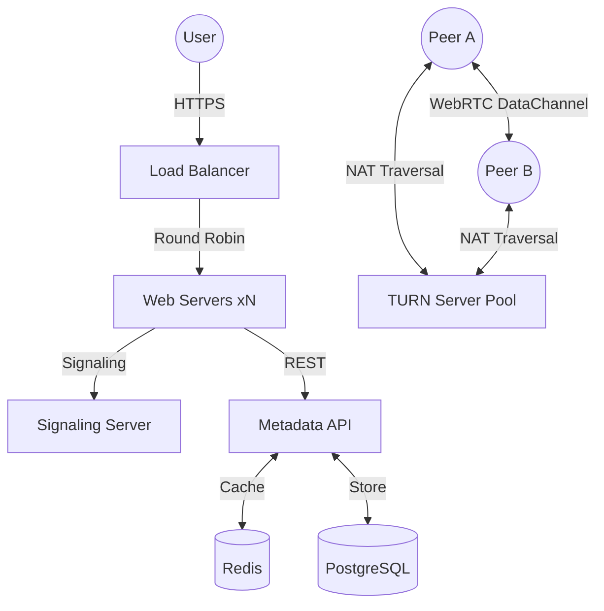

# Scalable P2P Architecture

This document describes the high-scale production architecture designed to support thousands of concurrent peer-to-peer file transfers with high availability and minimal latency.

## Architecture Overview

The system is designed with horizontal scalability in mind, separating concerns into logical layers:

1.  **Edge Layer**: Load balancing and SSL termination.
2.  **Web & Signaling Layer**: Serving static assets and managing WebRTC signaling.
3.  **Metadata Layer**: Short link generation and transient state management.
4.  **Persistence Layer**: PostgreSQL and Redis for durability and performance.
5.  **Network Relay Layer**: STUN/TURN servers for NAT traversal.

### Deployment Topology

## Service Components

### 1. Edge Proxy (Envoy)
We utilize **Envoy Proxy** as our primary edge component for:
- L7 load balancing with advanced health checks.
- TLS termination (ECDSA/RSA certificates).
- Header manipulation and rate limiting.
- Blue/Green traffic splitting for zero-downtime updates.

### 2. Web Servers
Nginx or the built-in Node.js server can be used to serve the React application. In high-traffic scenarios, we recommend:
- Gzip/Brotli compression for static assets.
- Long-term caching headers for immutable assets.

### 3. Signaling Infrastructure (PeerJS)
The signaling server facilitates the initial WebRTC handshake (SDP exchange and ICE candidates).
- **Scalability**: Can be horizontally scaled using sticky sessions at the load balancer.
- **Protocol**: WebSockets for low-latency state synchronization.

### 4. Metadata API
A lightweight Node.js service responsible for:
- Short link generation (Base62 encoding).
- Metadata validation and persistence.
- Automated cleanup of expired metadata (default 24h TTL).

### 5. Data Tier
- **PostgreSQL**: Stores robust metadata and audit logs.
- **Redis**: Acts as the primary cache for metadata retrieval, achieving sub-10ms response times for active links.

### 6. NAT Traversal (coturn)
Critical for P2P success in restrictive network environments.
- **Relay Capability**: coturn acts as a TURN relay when direct P2P (STUN) is blocked by symmetric NATs or firewalls.
- **Geographic Distribution**: Deploying TURN servers in multiple regions reduces latency for relayed traffic.

## Scaling Strategy

### Vertical vs. Horizontal
- **Web Layer**: Horizontally scale by adding more nodes behind the load balancer.
- **Metadata API**: Horizontally scale with stateless API instances.
- **Database**: Vertically scale initially; implement read replicas for metadata-heavy workloads.

### Capacity Planning
- **Standard Node**: 2 vCPU, 4GB RAM can handle ~500-1,000 concurrent signaling sessions.
- **TURN Bandwidth**: Scaling is primarily driven by network throughput. Monitor egress bandwidth closely.

## Security Architecture

- **Client-Side Encryption**: AES-GCM 256-bit encryption ensures file contents are never visible to any server component.
- **Transient State**: Metadata is stored with a TTL; no user data persists long-term.
- **Isolated Networks**: Deploy backend services (DB, Redis) in a private subnet, accessible only by the API layer.
- **Rate Limiting**: Protect metadata endpoints from brute-force discovery.

## Disaster Recovery

- **Stateless Services**: All web and API nodes are stateless and can be recreated instantly via Docker images.
- **Database Backups**: Daily snapshots and point-in-time recovery for PostgreSQL.
- **Health Monitoring**: Automated health checks at the edge layer to remove failing nodes from rotation.
