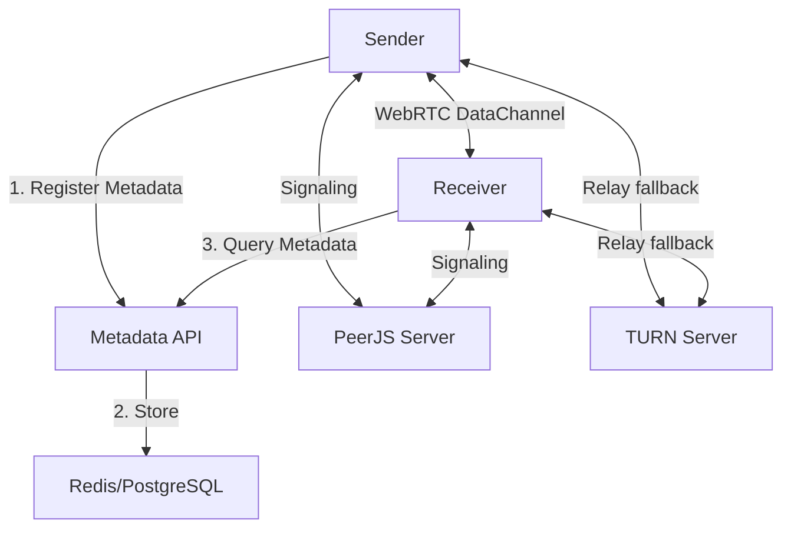

# P2P File Share

A high-performance, privacy-focused peer-to-peer file sharing platform utilizing WebRTC DataChannels for browser-to-browser transfers.

## Overview

P2P File Share is engineered for secure, direct data transfer without intermediary server storage. By leveraging modern browser APIs, it facilitates high-bandwidth transfers that scale with the users' own network capabilities rather than centralized server throughput.

### Key Technical Pillars

*   **Zero-Knowledge Transfers**: Files are encrypted in the browser using the Web Crypto API (AES-GCM 256-bit) before transmission. Keys are never transmitted to the server.
*   **WebRTC DataChannels**: Direct P2P communication for optimal latency and throughput.
*   **Hybrid Signaling Architecture**: Utilizes a lightweight signaling layer for peer discovery with robust STUN/TURN fallback for NAT traversal.
*   **Streaming I/O**: Implements the File System Access API to stream data directly to/from the local disk, bypassing memory constraints for multi-gigabyte transfers.
*   **Base62 Metadata Routing**: Efficient short-link generation and routing for transient metadata state.

## Technical Stack

### Frontend
- **Framework**: React 18+ with TypeScript
- **State Management**: Context API / Hooks
- **Styling**: Vanilla CSS with a focus on high-performance animations and glassmorphism.
- **P2P Engine**: WebRTC (via PeerJS abstraction)
- **Crypto**: AES-GCM (Browser-native)

### Backend Services
- **Signaling**: PeerJS Server (Node.js)
- **Metadata API**: Express.js with PostgreSQL persistence
- **Caching**: Redis for sub-10ms metadata retrieval and link expiration
- **Edge Proxy**: Envoy Proxy for L7 load balancing and TLS termination
- **NAT Traversal**: coturn (STUN/TURN)

## Architecture



## Self-Hosting Guide

P2P File Share is designed to be fully self-hostable on standard Linux environments.

### Prerequisites
- Docker & Docker Compose
- A domain name with SSL support
- Ports 80, 443, 3478 (UDP/TCP) open

### Deployment

1.  **Clone the Repository**:
    ```bash
    git clone https://github.com/RaveAgainstTheMachine/p2p.red.git
    cd p2p.red
    ```

2.  **Configure Environment**:
    Edit the provided `.env` and configuration files in `envoy.yaml` and `turnserver.conf`.

3.  **Launch Infrastructure**:
    ```bash
    docker compose up -d
    ```

For detailed instructions, see the [Self-Hosting Documentation](PROJECT_DOCUMENTATION/SELF_HOSTING.md).

## Security & Audit

This project prioritizes security through simplicity:
- **No Persistence**: File data is never stored or cached on the server.
- **Client-Side Encryption**: AES-GCM ensures that even if signaling or metadata layers are compromised, file contents remain inaccessible.
- **Minimal Metadata**: Only transient peer information is stored, with a default 24-hour TTL.

## License

This project is licensed under the **Business Source License 1.1** (BSL).

> [!IMPORTANT]
> **Free for everyone**, including production use, as long as your (or your organization's) annual revenue is **less than $5,000,000 USD**.

- **Licensor**: Steven Frost
- **Change Date**: January 1, 2030
- **Change License**: Apache License, Version 2.0

For more details, see the [LICENSE](LICENSE) file.
